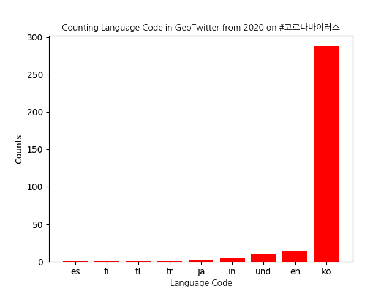

# Coronavirus: Twitter Hashtag Analysis

In this project, we analyze aspects of tweets with the hashtags `#coronavirus` and `#코로나바이러스` from 2020. Specifically, we investigate the distribution of Twitter user countries and the languages used in these tweets. We focus on the top 10 countries and languages in our analysis.

Our findings are presented in the following graphs:

## #코로나바이러스

  
  

The two plots are correlated, given that the hashtag we are analyzing is in Korean. As expected, the majority of tweets originated from Korea. However, there were also some number of English tweets, as well as some unidentified languages.

## #coronavirus 

  
  

Unlike the previous hashtag, `#coronavirus` was more widely used in geo-tweets from 2020. We observe that the majority of tweets were from the United States, followed by India and the United Kingdom. While English was the most commonly used language, Spanish and other identified languages were also present.

## Conclusion

In this project, we analyzed tweets with the hashtags `#coronavirus` and `#코로나바이러스` from 2020, focusing on the distribution of Twitter user countries and the languages used in these tweets. Our findings show that the hashtags were widely used in tweets from around the world, with `#coronavirus` being more popular. The majority of tweets for `#코로나바이러스` were from Korea, while the majority of tweets for `#coronavirus` were from the United States, India, and the United Kingdom. English was the most commonly used language for both hashtags.

Overall, this analysis provides insights into how Twitter users across the world engaged with the coronavirus pandemic in 2020. It highlights the importance of language in understanding social media trends and can inform future studies on the use of Twitter during global health crises.
